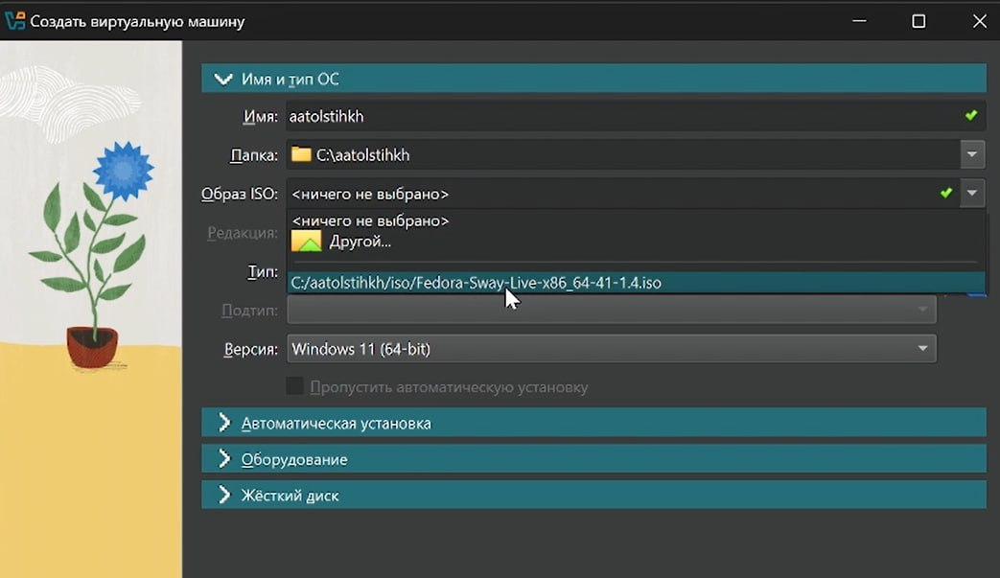
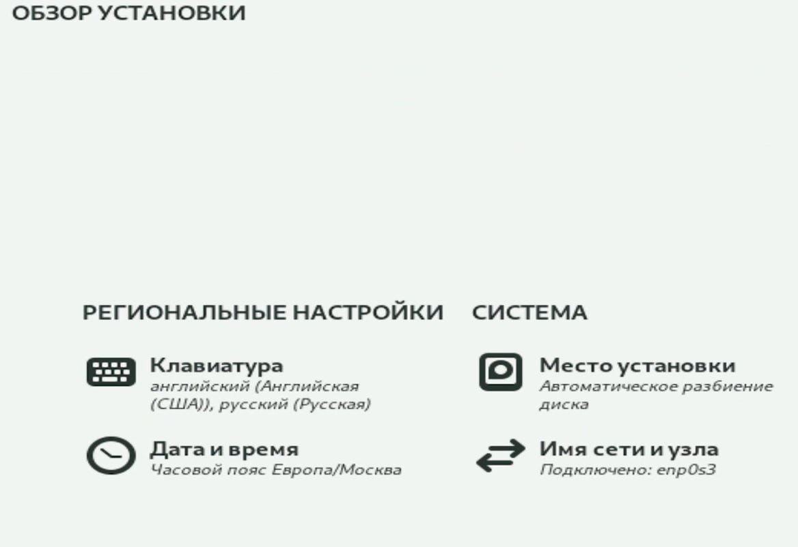
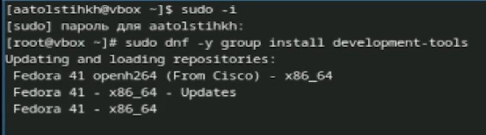
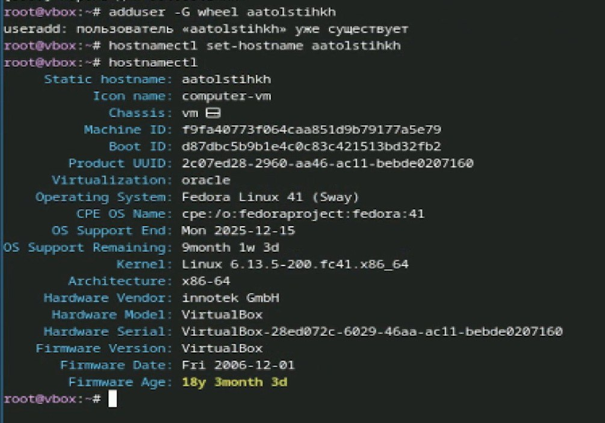
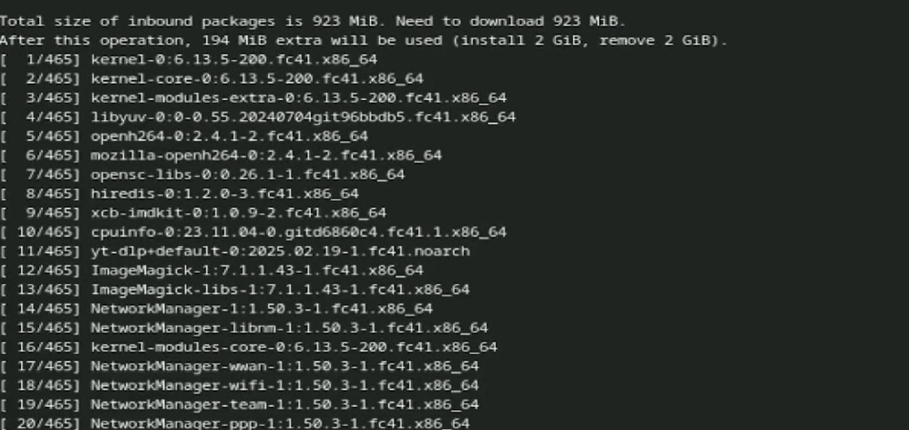
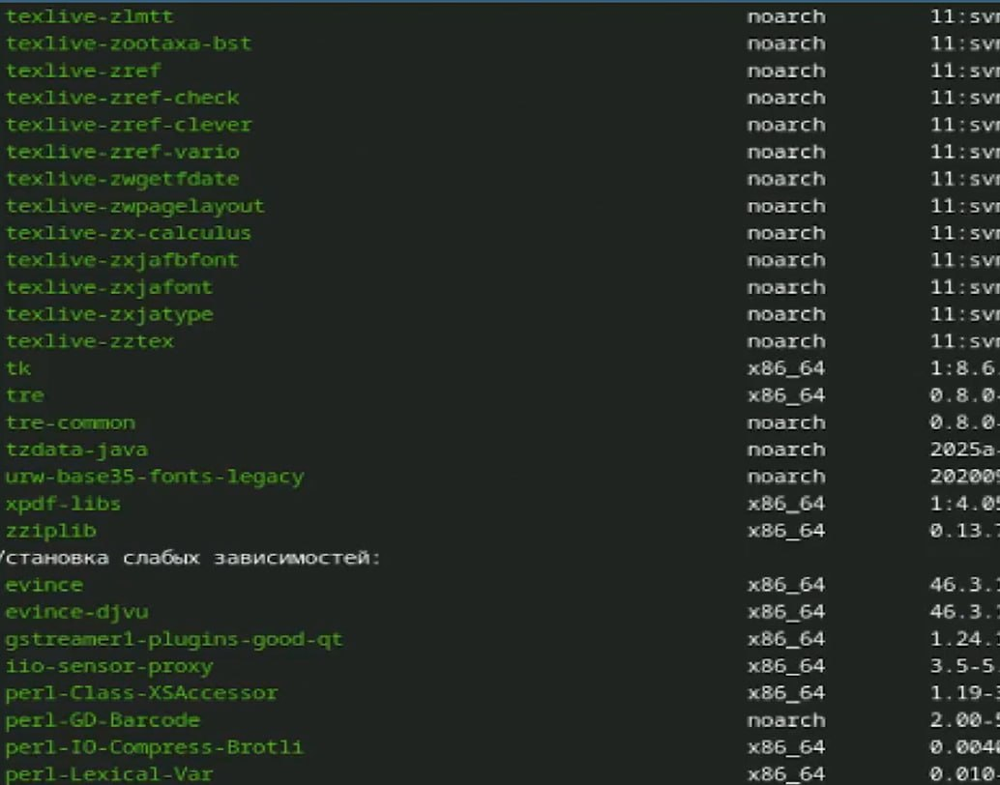

---
## Front matter
lang: ru-RU
title: Лабораторная работа № 1
subtitle: Установка линукс
author: Толстых А. А.
  - 
institute:
  - Российский университет дружбы народов, Москва, Россия
date: 08 марта 2025

## i18n babel
babel-lang: russian
babel-otherlangs: english

## Formatting pdf
toc: false
toc-title: Содержание
slide_level: 2
aspectratio: 169
section-titles: true
theme: metropolis
header-includes:
 - \metroset{progressbar=frametitle,sectionpage=progressbar,numbering=fraction}
---

# Информация

## Докладчик

  * Толстых Александра Андреевна
  * студент группы НММбд-03-24
  * Российский университет дружбы народов

# Вводная часть

## Цель

Целью данной работы является приобретение практических навыков установки операционной системы на виртуальную машину, настройки минимально необходимых для дальнейшей работы сервисов.

## Задание

- Создание виртуальной машины
- Настройка машины
- Установка дистрибутивов для работы с markdown

# Выполнение работы

## Создание машины

:::::::::::::: {.columns align=center}
::: {.column width="30%"}

Виртуальная машина у меня уже была установлена, поэтому я лишь создаю новую. 

:::
::: {.column width="70%"}

:::
::::::::::::::

## Установка версии

:::::::::::::: {.columns align=center}
::: {.column width="30%"}

При запуске я следую указаниям и с помошью anakonda завершаю установку. 

:::
::: {.column width="70%"}

:::
::::::::::::::

## Установка необходимых пакетов

:::::::::::::: {.columns align=center}
::: {.column width="30%"}

Открываю терминал, вхожу в учетную запись и выполняю установку необходимых пакетов.

:::
::: {.column width="70%"}

:::
::::::::::::::

## Установка необходимых пакетов

:::::::::::::: {.columns align=center}
::: {.column width="30%"}

Проверяю, что имя пользователя и прочее были корректно заданы во время создания машины.

:::
::: {.column width="70%"}

:::
::::::::::::::

## Установка необходимых пакетов

:::::::::::::: {.columns align=center}
::: {.column width="30%"}

Далее я устанавливаю pandoc.

:::
::: {.column width="70%"}

:::
::::::::::::::

## Установка необходимых пакетов

:::::::::::::: {.columns align=center}
::: {.column width="30%"}

Затем устанавливаю дистрибутив TeXlive.

:::
::: {.column width="70%"}

:::
::::::::::::::

# Завершение работы

## Выводы

В результате выполнения данной работы я приобрела практические навыки установки операционной системы на виртуальную машину, настройки минимально необходимых для дальнейшей работы сервисов.
