---
## Front matter
lang: ru-RU
title: Лабораторная работа № 2
subtitle: Первоначальная настройка git
author: Толстых А. А.
institute:
  - Российский университет дружбы народов, Москва, Россия
date: 08 марта 2025

## i18n babel
babel-lang: russian
babel-otherlangs: english

## Formatting pdf
toc: false
toc-title: Содержание
slide_level: 2
aspectratio: 169
section-titles: true
theme: metropolis
header-includes:
 - \metroset{progressbar=frametitle,sectionpage=progressbar,numbering=fraction}
---

# Информация

## Докладчик

  * Толстых Александра Андреевна
  * студент группы НММбд-03-24
  * Российский университет дружбы народов

# Вводная часть

## Цель

Изучить идеологию и применение средств контроля версий. Освоить умения по работе с git.

## Задание

- Создать базовую конфигурацию для работы с git.
- Создать ключ SSH.
- Создать ключ PGP.
- Настроить подписи git.
- Зарегистрироваться на Github.
- Создать локальный каталог для выполнения заданий по предмету.

## Теоретическое введение

- git init: Создать репозиторий.
- git pull: Получить обновления из удалённого репозитория.
- git push: Отправить изменения в удалённый репозиторий.
- git add .: Добавить все изменения в индекс.
- git commit -am “Сообщение”: Зафиксировать изменения с сообщением.

# Выполнение работы

## Установка пакета

:::::::::::::: {.columns align=center}
::: {.column width="30%"}

Выполняю установку git при помощи команды "dnf install git" и установку gh при помощи команды "dnf install gh".

:::
::: {.column width="70%"}

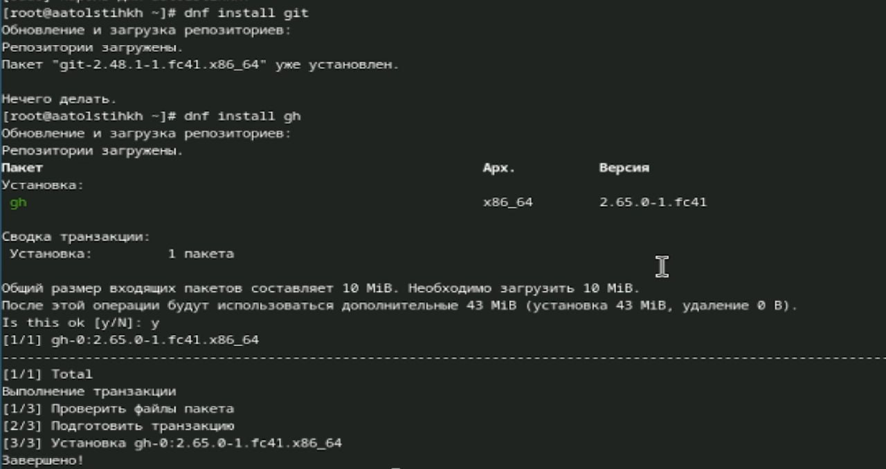

:::
::::::::::::::

## Базовая настройка

:::::::::::::: {.columns align=center}
::: {.column width="30%"}

Также выполняю базовую настройку git, указывая свои имя и фамилию, а также почту. 

:::
::: {.column width="70%"}

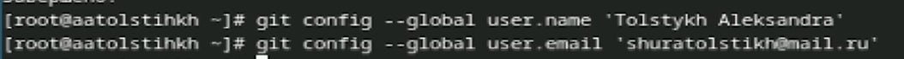

:::
::::::::::::::

## Прочие настройки

:::::::::::::: {.columns align=center}
::: {.column width="30%"}

Далее настраиваю прочие параметры.

:::
::: {.column width="70%"}

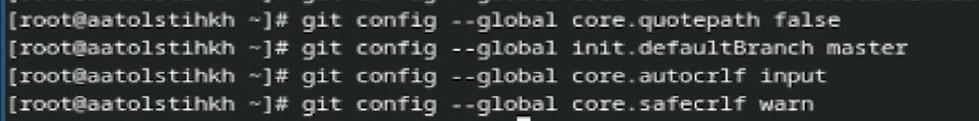

:::
::::::::::::::

## Создание ключей

:::::::::::::: {.columns align=center}
::: {.column width="30%"}

Создаю ssh ключи.

:::
::: {.column width="70%"}

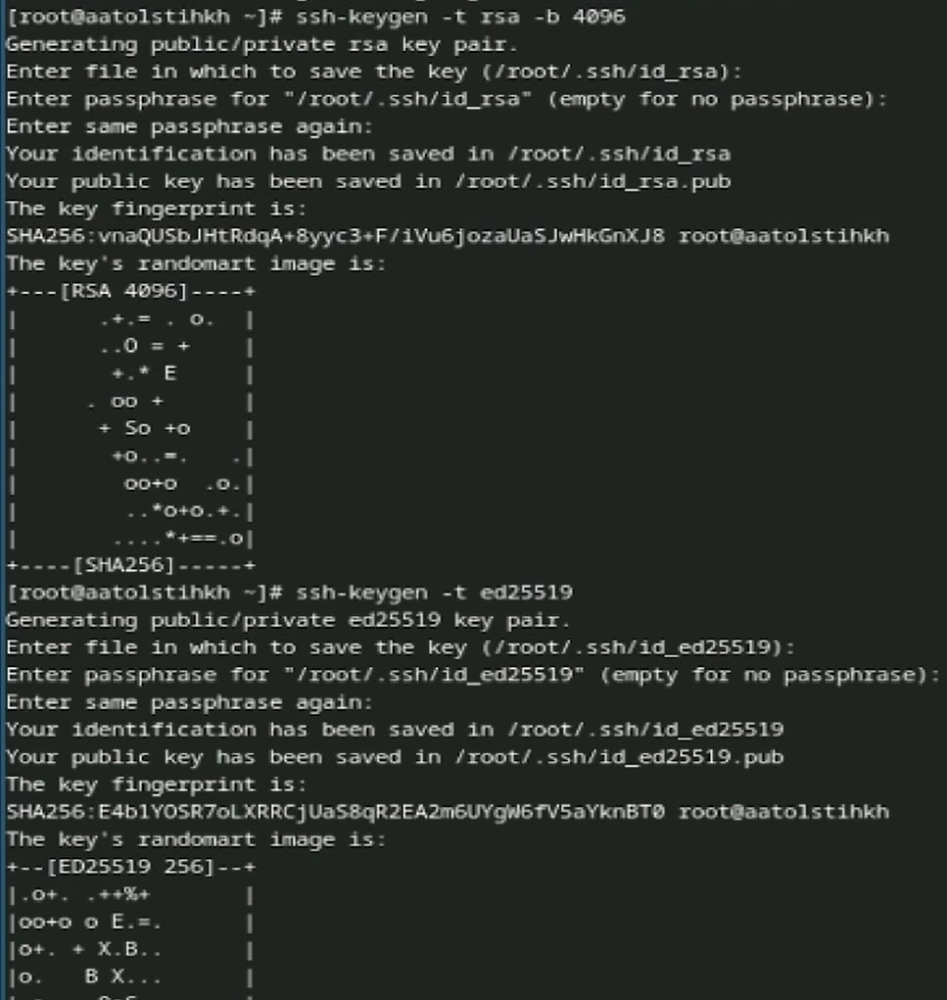

:::
::::::::::::::

## Создание ключей

:::::::::::::: {.columns align=center}
::: {.column width="30%"}

Создаю pgp ключи.

:::
::: {.column width="70%"}

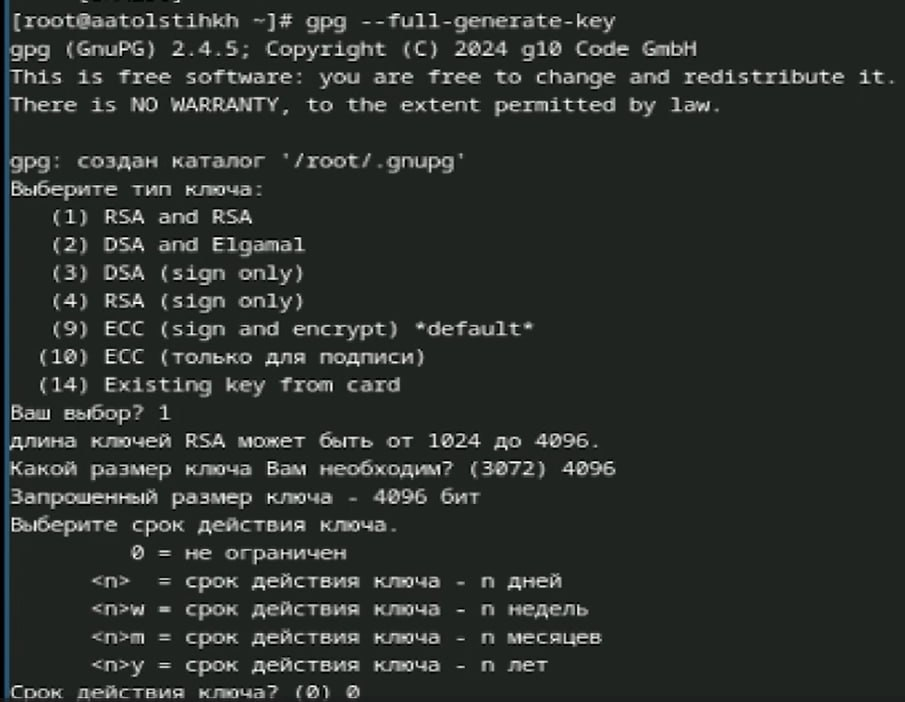

:::
::::::::::::::

## Добавление ключа

:::::::::::::: {.columns align=center}
::: {.column width="30%"}

Добавляю pgp ключ в гитхаб.

:::
::: {.column width="70%"}

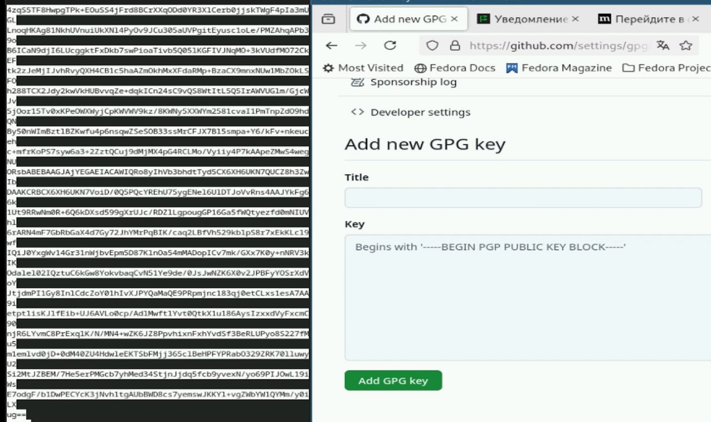

:::
::::::::::::::

## Прочие настройки

:::::::::::::: {.columns align=center}
::: {.column width="30%"}

Настраиваю автоматические подписи коммитов.

:::
::: {.column width="70%"}

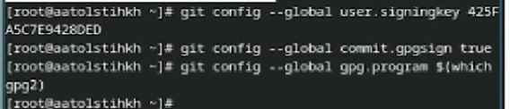

:::
::::::::::::::

## Прочие настройки

:::::::::::::: {.columns align=center}
::: {.column width="30%"}

Выполняю настройку gh.

:::
::: {.column width="70%"}

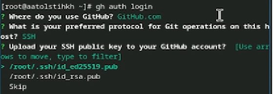

:::
::::::::::::::

## Шаблон курса

:::::::::::::: {.columns align=center}
::: {.column width="30%"}

Создаю шаблон рабочего пространства, копируя его из необходимого.

:::
::: {.column width="70%"}

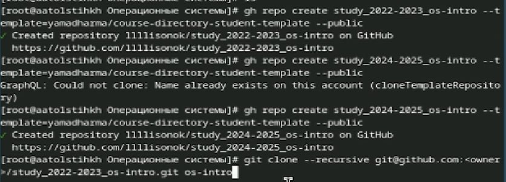

:::
::::::::::::::

## Шаблон курса

:::::::::::::: {.columns align=center}
::: {.column width="30%"}

Настраиваю каталог курса.

:::
::: {.column width="70%"}

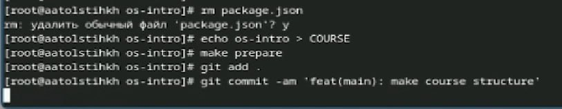

:::
::::::::::::::

## Шаблон курса

:::::::::::::: {.columns align=center}
::: {.column width="30%"}

Сохраняю изменения на гитхабе.

:::
::: {.column width="70%"}

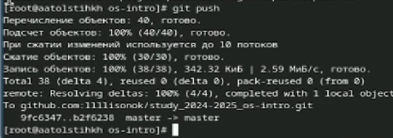

:::
::::::::::::::

# Завершение работы

## Выводы

В ходе выполнения я изучила идеологию и применение средств контроля версий и освоила умения по работе с git.
