---
## Front matter
title: "Лабораторная работа № 2"
subtitle: "Первоначальна настрой"
author: "Толстых Александра НММбд-03-24"

## Generic otions
lang: ru-RU
toc-title: "Содержание"

## Bibliography
bibliography: bib/cite.bib
csl: pandoc/csl/gost-r-7-0-5-2008-numeric.csl

## Pdf output format
toc: true # Table of contents
toc-depth: 2
lof: true # List of figures
lot: true # List of tables
fontsize: 12pt
linestretch: 1.5
papersize: a4
documentclass: scrreprt
## I18n polyglossia
polyglossia-lang:
  name: russian
  options:
	- spelling=modern
	- babelshorthands=true
polyglossia-otherlangs:
  name: english
## I18n babel
babel-lang: russian
babel-otherlangs: english
## Fonts
mainfont: IBM Plex Serif
romanfont: IBM Plex Serif
sansfont: IBM Plex Sans
monofont: IBM Plex Mono
mathfont: STIX Two Math
mainfontoptions: Ligatures=Common,Ligatures=TeX,Scale=0.94
romanfontoptions: Ligatures=Common,Ligatures=TeX,Scale=0.94
sansfontoptions: Ligatures=Common,Ligatures=TeX,Scale=MatchLowercase,Scale=0.94
monofontoptions: Scale=MatchLowercase,Scale=0.94,FakeStretch=0.9
mathfontoptions:
## Biblatex
biblatex: true
biblio-style: "gost-numeric"
biblatexoptions:
  - parentracker=true
  - backend=biber
  - hyperref=auto
  - language=auto
  - autolang=other*
  - citestyle=gost-numeric
## Pandoc-crossref LaTeX customization
figureTitle: "Рис."
tableTitle: "Таблица"
listingTitle: "Листинг"
lofTitle: "Список иллюстраций"
lotTitle: "Список таблиц"
lolTitle: "Листинги"
## Misc options
indent: true
header-includes:
  - \usepackage{indentfirst}
  - \usepackage{float} # keep figures where there are in the text
  - \floatplacement{figure}{H} # keep figures where there are in the text
---

# Цель работы

Изучить идеологию и применение средств контроля версий. Освоить умения по работе с git.

# Задание

- Создать базовую конфигурацию для работы с git.
- Создать ключ SSH.
- Создать ключ PGP.
- Настроить подписи git.
- Зарегистрироваться на Github.
- Создать локальный каталог для выполнения заданий по предмету.

# Теоретическое введение

Основные команды Git:

- git init: Создать репозиторий.
- git pull: Получить обновления из удалённого репозитория.
- git push: Отправить изменения в удалённый репозиторий.
- git status: Показать изменённые файлы.
- git diff: Показать изменения в файлах.
- git add .: Добавить все изменения в индекс.
- git add <файлы>: Добавить конкретные файлы в индекс.
- git rm <файлы>: Удалить файлы из индекса (оставить в локальной директории).
- git commit -am “Сообщение”: Зафиксировать изменения с сообщением.
- git commit: Зафиксировать изменения с сообщением через редактор.
- git checkout -b <ветка>: Создать и переключиться на новую ветку.
- git checkout <ветка>: Переключиться на существующую ветку.
- git push origin <ветка>: Отправить ветку в удалённый репозиторий.
- git merge –no-ff <ветка>: Объединить ветку с текущей (создать коммит слияния).
- git branch -d <ветка>: Удалить локальную ветку (после слияния).
- git branch -D <ветка>: Принудительно удалить локальную ветку.
- git push origin :<ветка>: Удалить ветку из удалённого репозитория.

# Выполнение лабораторной работы

Выполняю установку git при помощи команды "dnf install git" и установку gh при помощи команды "dnf install gh" (рис. [-@fig:001]).

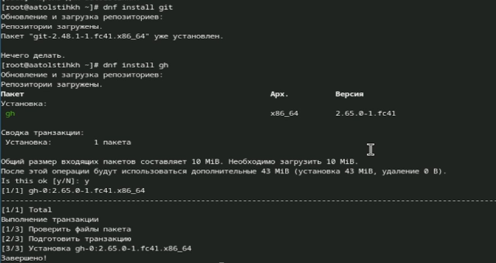{#fig:001 width=70%}

Также выполняю базовую настройку git, указывая свои имя и фамилию, а также почту (рис. [-@fig:002]).

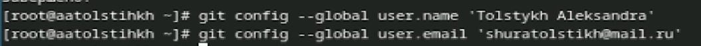{#fig:002 width=70%}

Далее настраиваю прочие параметры (рис. [-@fig:003]).

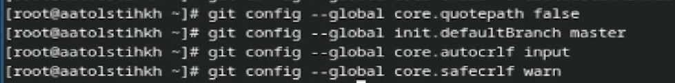{#fig:003 width=70%}

Создаю ssh ключи (рис. [-@fig:004]).

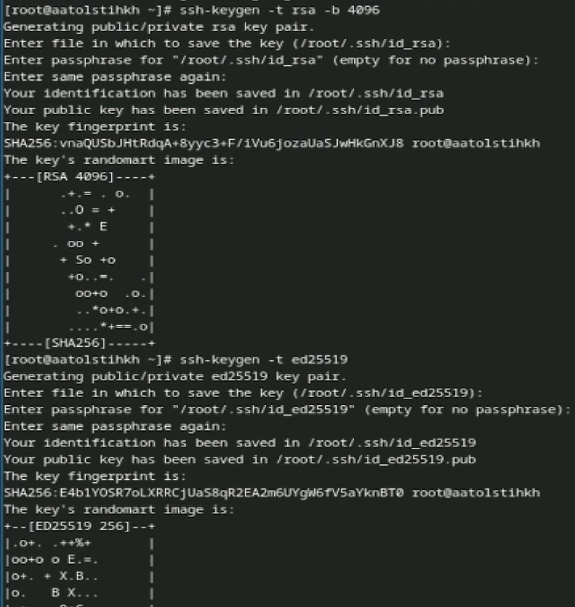{#fig:004 width=70%}

Создаю pgp ключи (рис. [-@fig:005]).

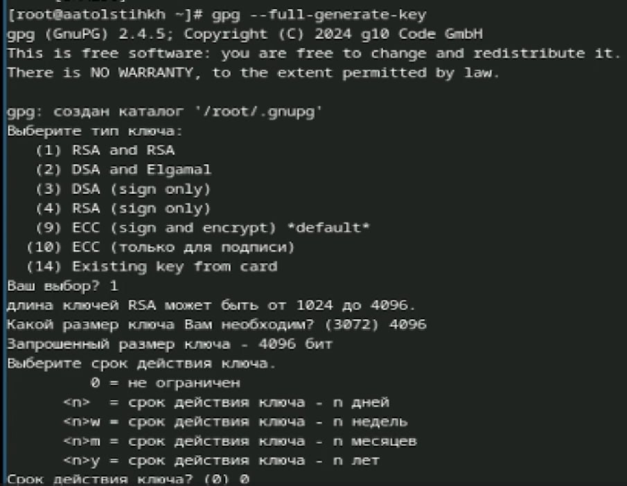{#fig:005 width=70%}

Добавляю pgp ключ в гитхаб (рис. [-@fig:006]).

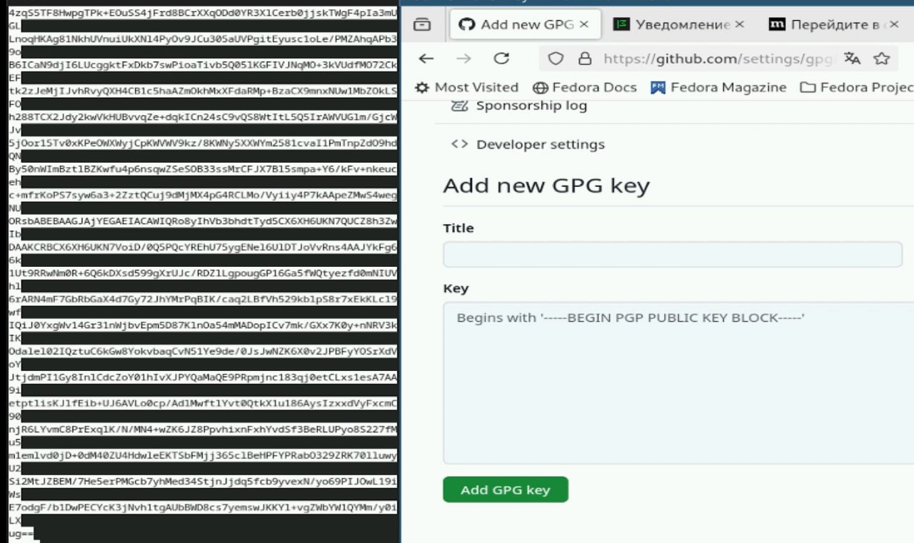{#fig:006 width=70%}

Настраиваю автоматические подписи коммитов git (рис. [-@fig:007]).

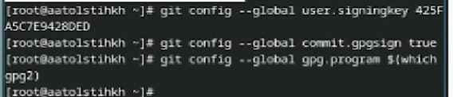{#fig:007 width=70%}

Выполняю настройку gh (рис. [-@fig:008]).

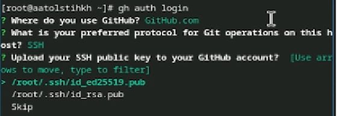{#fig:008 width=70%}

Создаю шаблон рабочего пространства, копируя его из необходимого (рис. [-@fig:009]).

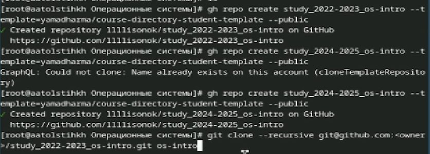{#fig:009 width=70%}

Настраиваю каталог курса (рис. [-@fig:010]).

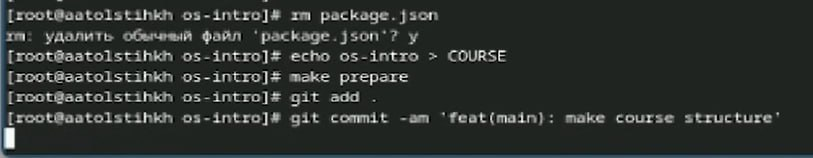{#fig:010 width=70%}

Сохраняю изменения на гитхабе (рис. [-@fig:011]).

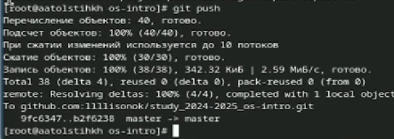{#fig:011 width=70%}

# Выводы

В ходе выполнения я изучила идеологию и применение средств контроля версий и освоила умения по работе с git.

# Список литературы{.unnumbered}

::: {#refs}
:::
