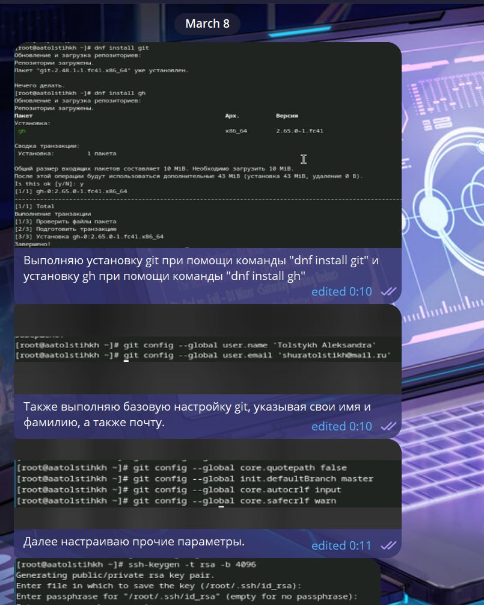
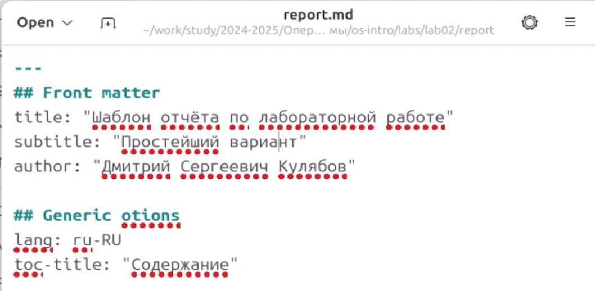
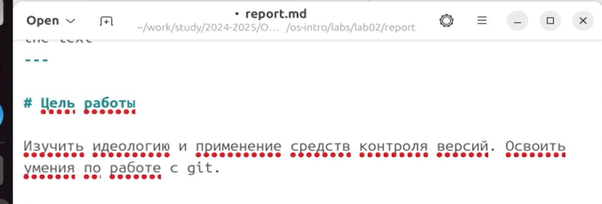
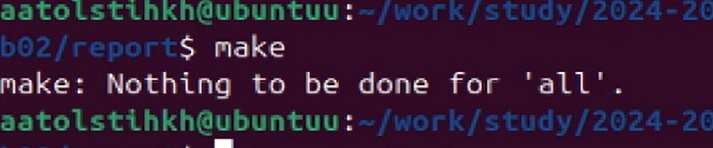
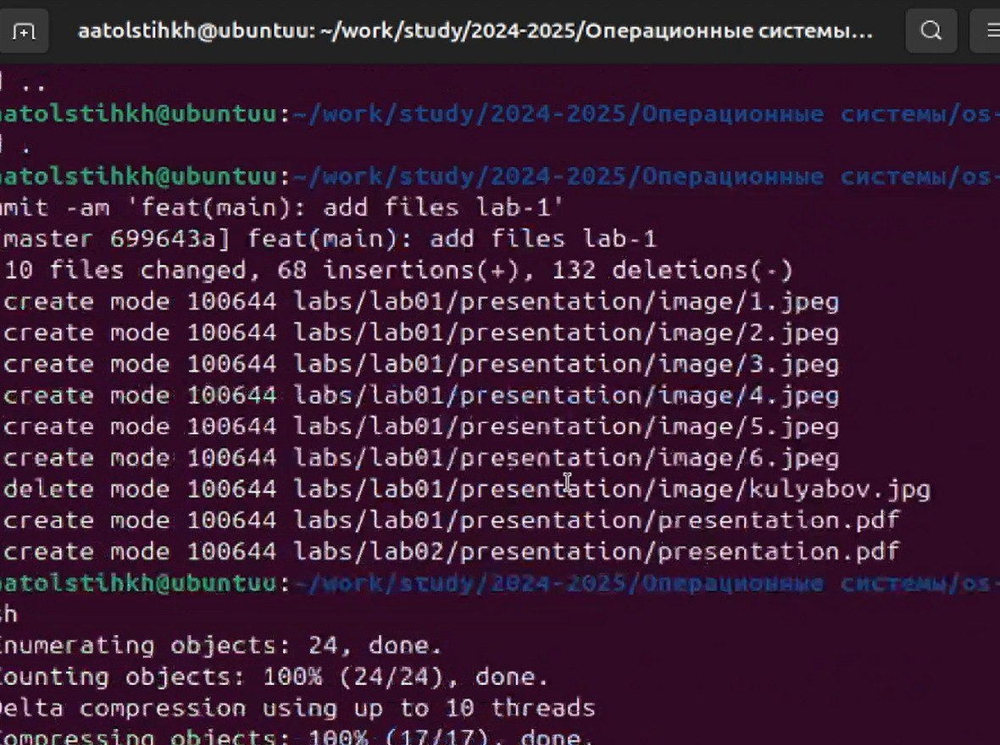

---
## Front matter
lang: ru-RU
title: Лабораторная работа № 3
subtitle: Основы работы с markdown
author: Толстых А. А.
institute:
  - Российский университет дружбы народов, Москва, Россия
date: 08 марта 2025

## i18n babel
babel-lang: russian
babel-otherlangs: english

## Formatting pdf
toc: false
toc-title: Содержание
slide_level: 2
aspectratio: 169
section-titles: true
theme: metropolis
header-includes:
 - \metroset{progressbar=frametitle,sectionpage=progressbar,numbering=fraction}
---

# Информация

## Докладчик

  * Толстых Александра Андреевна
  * студент группы НММбд-03-24
  * Российский университет дружбы народов

# Вводная часть

## Цель

Научиться оформлять отчёты с помощью легковесного языка разметки Markdown.

## Задание

Написать отчет ко второй лабораторной.

# Выполнение работы

## Написание текста отчета

:::::::::::::: {.columns align=center}
::: {.column width="30%"}

Для своего комфорта, пишу текст отчета себе в сообщениях, чтобы затем его просто скопировать.

:::
::: {.column width="70%"}

:::
::::::::::::::

## Создание отчета

:::::::::::::: {.columns align=center}
::: {.column width="30%"}

Открываю в удобной мне системе markdown файл.

:::
::: {.column width="70%"}

:::
::::::::::::::

## Изменение файла

:::::::::::::: {.columns align=center}
::: {.column width="30%"}

Вношу в него написанный текст, включая картинки и прочий текст.

:::
::: {.column width="70%"}

:::
::::::::::::::

## Компиляция отчета

:::::::::::::: {.columns align=center}
::: {.column width="30%"}

Использую команду make для компиляции отчета.

:::
::: {.column width="70%"}

:::
::::::::::::::

## Сохранение изменений

:::::::::::::: {.columns align=center}
::: {.column width="30%"}

Сохраняю изменения на гитхаб.

:::
::: {.column width="70%"}

:::
::::::::::::::

# Завершение работы

## Выводы

В ходе выполнения лабораторной работы я научилась оформлять отчёты с помощью легковесного языка разметки Markdown.
