---
## Front matter
lang: ru-RU
title: Лабораторная работа № 4
subtitle: Продвинутое использование git
author: Толстых А. А.
institute:
  - Российский университет дружбы народов, Москва, Россия
date: 08 марта 2025

## i18n babel
babel-lang: russian
babel-otherlangs: english

## Formatting pdf
toc: false
toc-title: Содержание
slide_level: 2
aspectratio: 169
section-titles: true
theme: metropolis
header-includes:
 - \metroset{progressbar=frametitle,sectionpage=progressbar,numbering=fraction}
---

# Информация

## Докладчик

  * Толстых Александра Андреевна
  * студент группы НММбд-03-24
  * Российский университет дружбы народов

# Вводная часть

## Цель

Получение навыков правильной работы с репозиториями git.

## Задание

- Выполнить работу для тестового репозитория.
- Преобразовать рабочий репозиторий в репозиторий с git-flow и conventional commits.

# Выполнение работы

## Создание репозитория

:::::::::::::: {.columns align=center}
::: {.column width="30%"}

Создаю репозиторий на GitHub.

:::
::: {.column width="70%"}

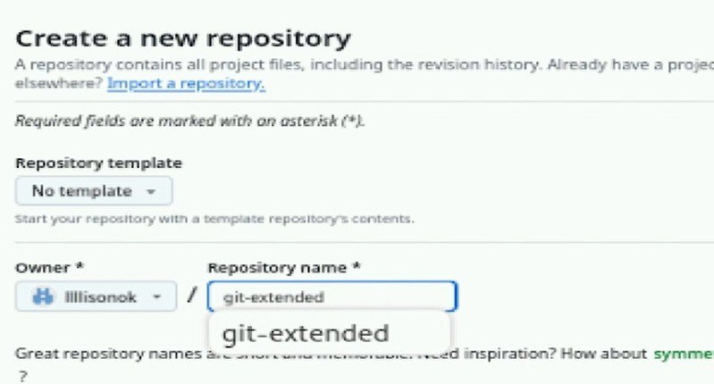

:::
::::::::::::::

## Работа с репозиторием

:::::::::::::: {.columns align=center}
::: {.column width="30%"}

Создаю копию репозитория у себя на ноутбуке.

:::
::: {.column width="70%"}

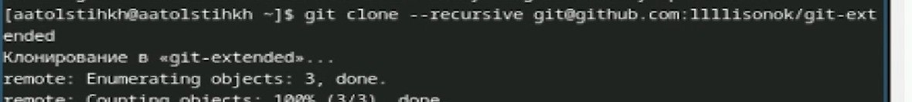

:::
::::::::::::::

## Настройки

:::::::::::::: {.columns align=center}
::: {.column width="30%"}

Настраиваю коммиты.

:::
::: {.column width="70%"}

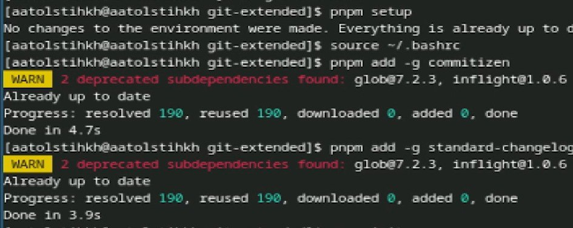

:::
::::::::::::::

## Работа с первым релизом

:::::::::::::: {.columns align=center}
::: {.column width="30%"}

Изменяю файл package.json.

:::
::: {.column width="70%"}

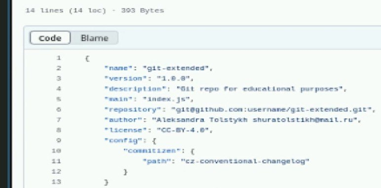

:::
::::::::::::::

## Работа с первым релизом

:::::::::::::: {.columns align=center}
::: {.column width="30%"}

Инициализирую git-flow.

:::
::: {.column width="70%"}

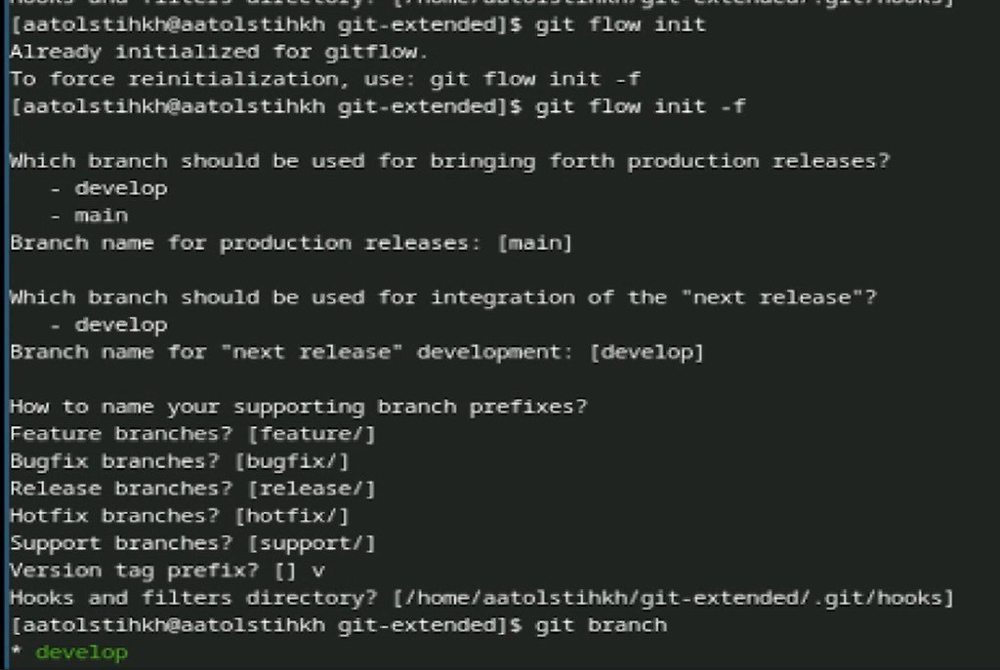

:::
::::::::::::::

## Работа с первым релизом

:::::::::::::: {.columns align=center}
::: {.column width="30%"}

Загружаю репозиторий в хранилище.

:::
::: {.column width="70%"}

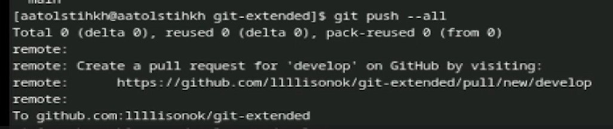

:::
::::::::::::::

## Работа с первым релизом

:::::::::::::: {.columns align=center}
::: {.column width="30%"}

Работаю с релизом 1.0.0.

:::
::: {.column width="70%"}

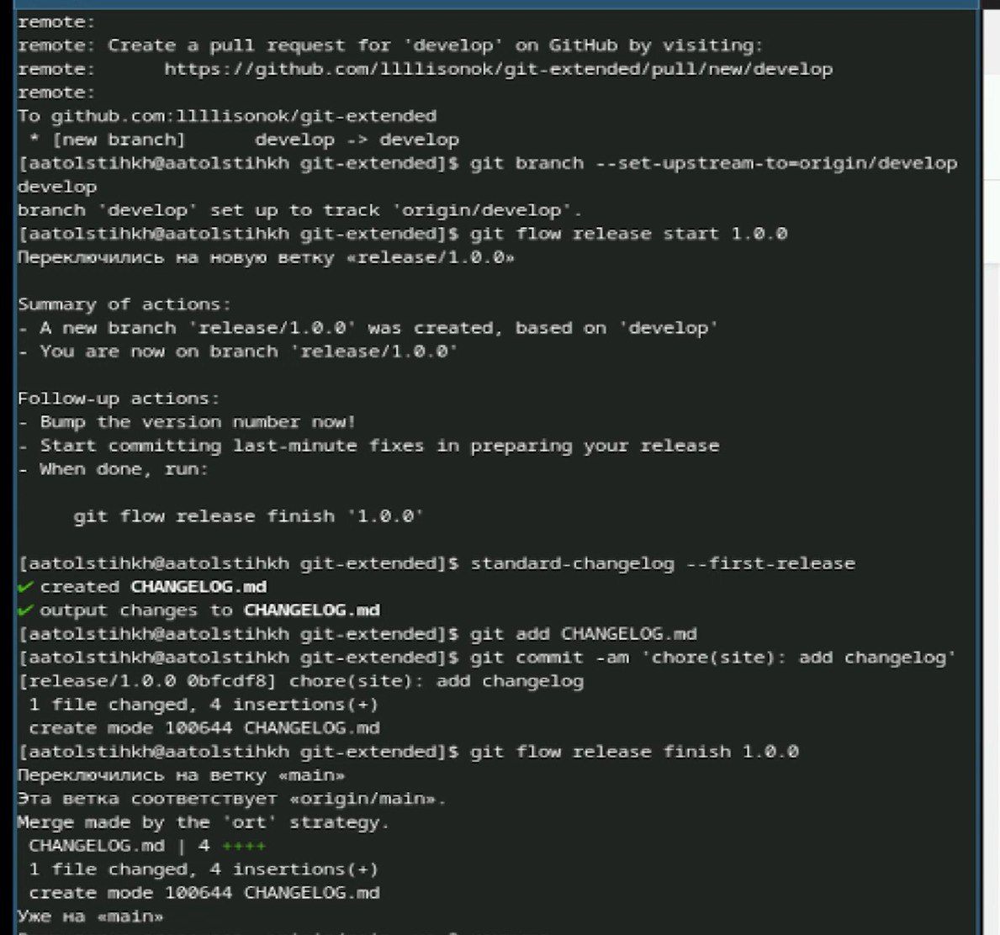

:::
::::::::::::::

## Сохранение релиза

:::::::::::::: {.columns align=center}
::: {.column width="30%"}

Сохраняю релиз 1.0.0.

:::
::: {.column width="70%"}

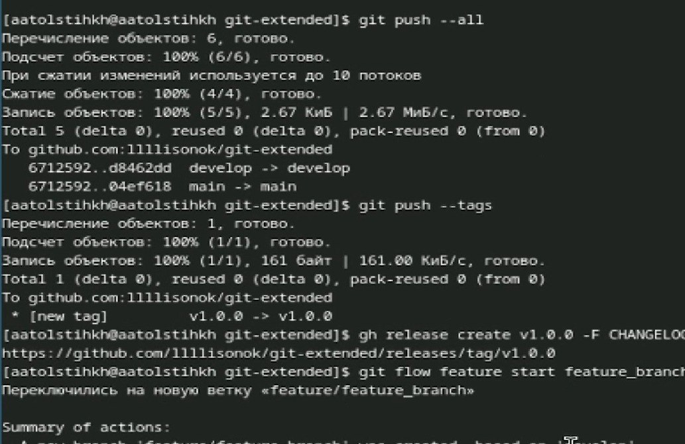

:::
::::::::::::::

## Смена ветки

:::::::::::::: {.columns align=center}
::: {.column width="30%"}

Переключаюсь на ветку для нового релиза.

:::
::: {.column width="70%"}

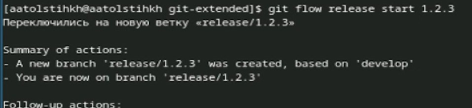

:::
::::::::::::::

## Работа со вторым релизом

:::::::::::::: {.columns align=center}
::: {.column width="30%"}

Работаю с релизом 1.2.3.

:::
::: {.column width="70%"}

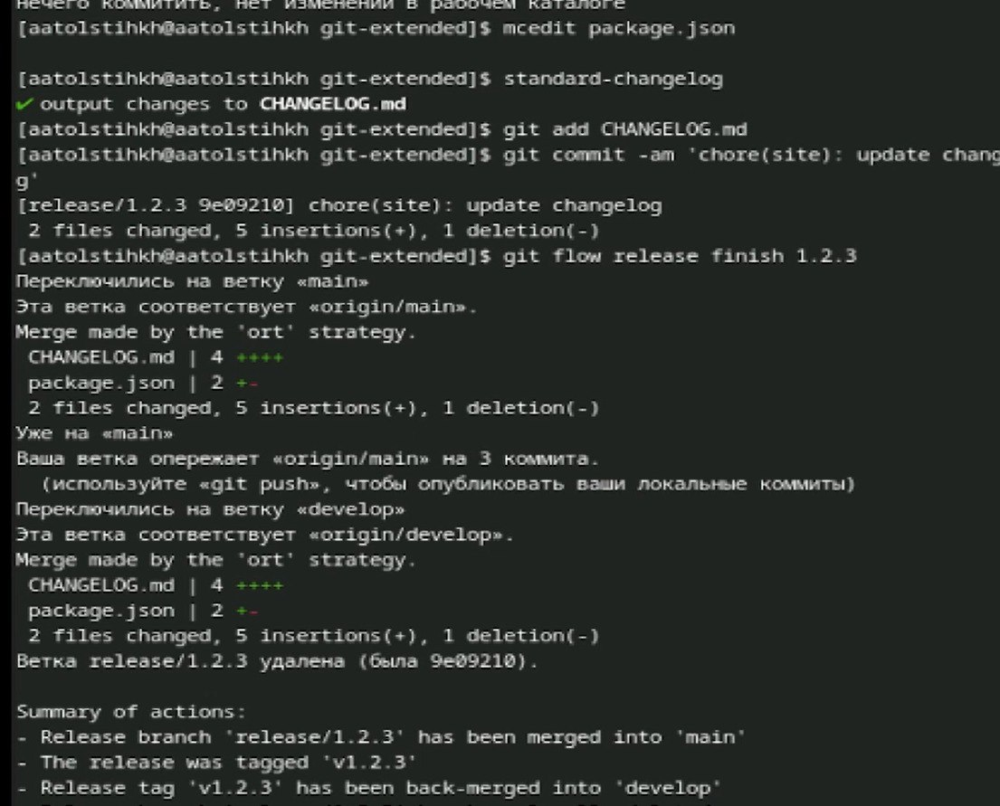

:::
::::::::::::::

## Сохранение изменений

:::::::::::::: {.columns align=center}
::: {.column width="30%"}

СЗавершаю работу с релизом и сохраняю его.

:::
::: {.column width="70%"}

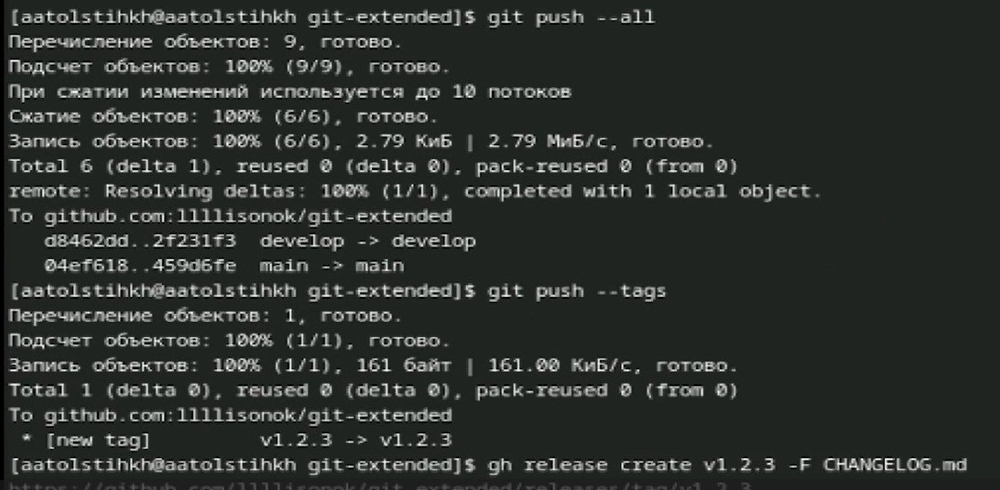

:::
::::::::::::::

# Завершение работы

## Выводы

В ходе выполнения работы были приобретены навыки правильной работы с репозиториями git.
