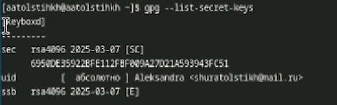
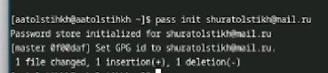
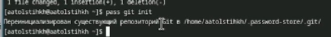
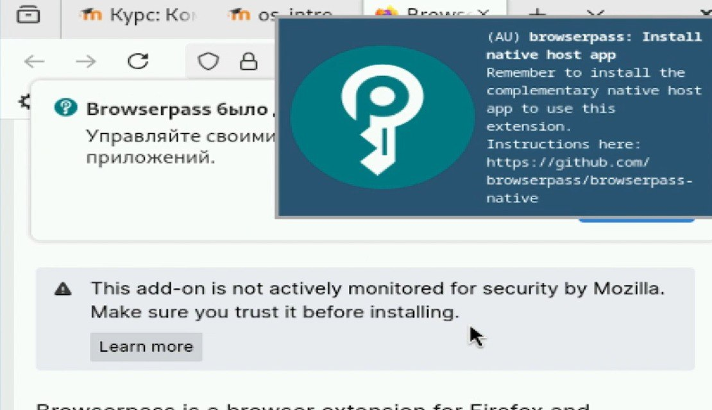
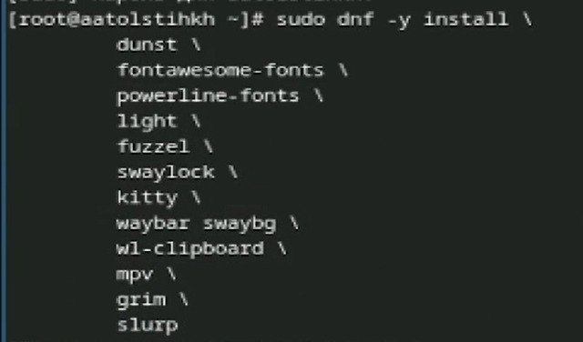
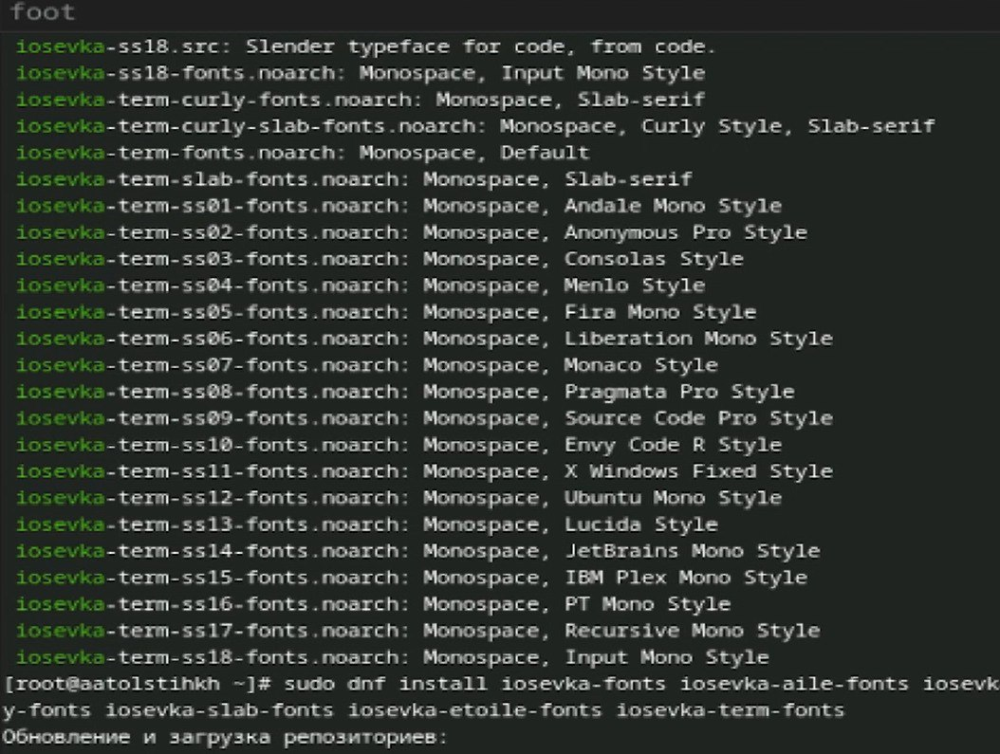
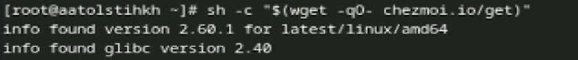
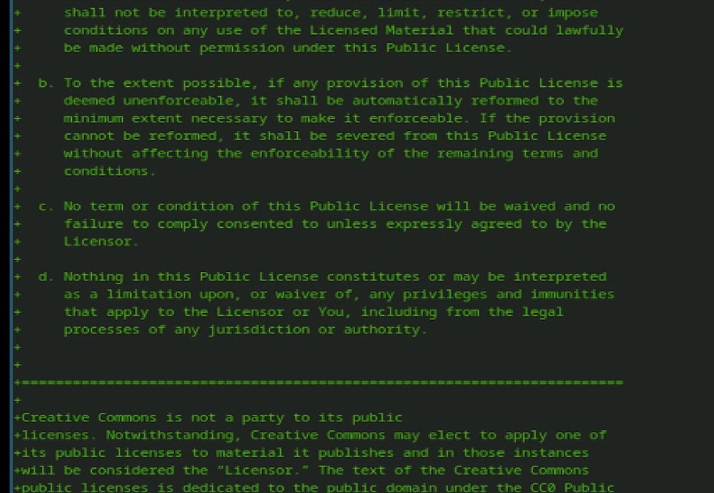

---
## Front matter
lang: ru-RU
title: Лабораторная работа № 4
subtitle: Продвинутое использование git
author: Толстых А. А.
institute:
  - Российский университет дружбы народов, Москва, Россия
date: 08 марта 2025

## i18n babel
babel-lang: russian
babel-otherlangs: english

## Formatting pdf
toc: false
toc-title: Содержание
slide_level: 2
aspectratio: 169
section-titles: true
theme: metropolis
header-includes:
 - \metroset{progressbar=frametitle,sectionpage=progressbar,numbering=fraction}
---

# Информация

## Докладчик

  * Толстых Александра Андреевна
  * студент группы НММбд-03-24
  * Российский университет дружбы народов

# Вводная часть

## Цель

Настройка рабочей среды.

## Задание

- Менеджер паролей pass.
- Управление файлами конфигурации.
- Дополнительное программное обеспечение.

# Выполнение работы

## Ключи

:::::::::::::: {.columns align=center}
::: {.column width="30%"}

Все необходимые пакеты у меня уже были установлены, поэтому данный шаг я пропускаю. Просматриваю список ключей.

:::
::: {.column width="70%"}

:::
::::::::::::::

## Инициализация

:::::::::::::: {.columns align=center}
::: {.column width="30%"}

Инициализирую хранилище.

:::
::: {.column width="70%"}

:::
::::::::::::::

## Структура гит

:::::::::::::: {.columns align=center}
::: {.column width="30%"}

Создаю структуру гит.

:::
::: {.column width="70%"}

:::
::::::::::::::

## Установка пакетов

:::::::::::::: {.columns align=center}
::: {.column width="30%"}

Устанавливаю необходимый плагин.

:::
::: {.column width="70%"}

:::
::::::::::::::

## Установка пакетов

:::::::::::::: {.columns align=center}
::: {.column width="30%"}

Устанавливаю дополнительное программное обеспечение.

:::
::: {.column width="70%"}

:::
::::::::::::::

## Установка пакетов

:::::::::::::: {.columns align=center}
::: {.column width="30%"}

Устанавливаю необходимые шрифты.

:::
::: {.column width="70%"}

:::
::::::::::::::

## Установка пакетов

:::::::::::::: {.columns align=center}
::: {.column width="30%"}

Устанавливаю бинарный файл.

:::
::: {.column width="70%"}

:::
::::::::::::::

## Работа с репозиторием

:::::::::::::: {.columns align=center}
::: {.column width="30%"}

Создаю репозиторий для конфигурационных файлов. Проверяю и сохраняю изменения.

:::
::: {.column width="70%"}

:::
::::::::::::::

# Завершение работы

## Выводы

В ходе лабораторной работы я выполнила настройку рабочей среды.
