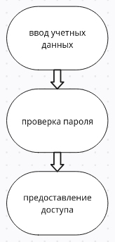

---
## Front matter
lang: ru-RU
title: Схема аутентификации пользователей с помощью логинов и паролей в UNIX 
subtitle: Доклад к лекции №5, выполнила Толстых Александра Андреевна
author:
  - Кулябов Д. С., д.ф.-м.н., профессор
institute: 
  - Российский университет дружбы народов, Москва, Россия
date: 27 марта 2025

## i18n babel
babel-lang: russian
babel-otherlangs: english

## Formatting pdf
toc: false
toc-title: Содержание
slide_level: 2
aspectratio: 169
section-titles: true
theme: metropolis
header-includes:
 - \metroset{progressbar=frametitle,sectionpage=progressbar,numbering=fraction}
---

# Информация

## Докладчик

:::::::::::::: {.columns align=center}
::: {.column width="70%"}

  * Толстых Александра Андреевна
  * студентка 1 курса, бакалавриат, ФФМиЕН
  * учебная группа НММбд-03-24
  * [1132246815@pfur.ru](mailto:1132246815@pfur.ru)

:::
::: {.column width="30%"}

:::
::::::::::::::

# Вводная часть

## Актуальность

:::::::::::::: {.columns align=center}
::: {.column width="80%"}

- Взрывной рост киберугроз – защита данных критична.
- Компрометация учетных записей = серьезные последствия.
- Аутентификация (логин/пароль) — базовая, но уязвимая функция.
- Современные атаки требуют постоянного усиления защиты.

:::
::: {.column width="20%"}

:::
::::::::::::::

## Объект и предмет исследования

- Объект: Схема аутентификации пользователей в UNIX-подобных ОС.
- Предмет: Механизмы входа в систему, уязвимости и современные подходы к усилению безопасности.

## Практическая значимость работы

- Повышение безопасности UNIX-систем за счет внедрения современных методов защиты.
- Рекомендации для администраторов по правильной настройке и управлению аутентификацией.
- Снижение рисков компрометации учётных записей и несанкционированного доступа к данным.

# Цели и задачи

Цель: Всесторонний анализ схемы аутентификации и разработка рекомендаций по ее усилению.

Задачи:

- Изучение архитектуры (passwd, shadow, PAM).
- Анализ методов хранения и проверки паролей.
- Выявление уязвимостей и рисков.
- Рассмотрение современных подходов.
- Формулирование рекомендаций.

# Содержание исследования

## Архитектура аутентификации UNIX

- passwd. Исторически здесь хранился хэш пароля, в современных системах в этом файле хранится символ «x» или «*». 
- shadow. В этом файле хранится зашифрованный (хешированный) пароль пользователя, дата последней смены пароля, минимальный и максимальный срок действия пароля, а также другие параметры, связанные с управлением паролями.
- PAM: Гибкая система аутентификации, позволяющая использовать различные методы проверки подлинности пользователя.

## Методы хранения и проверки паролей

- Хеширование паролей
- «Соль» (Salt)
- Алгоритмы хеширования: (SHA-256 и SHA-512, bcrypt, scrypt, Argon2)

## Уязвимости и риски: (Брутфорс, словарные атаки, фишинг)

- Атаки методом перебора (Brute-force атаки)
- Словарные атаки (Dictionary attacks)
- Атаки с использованием радужных таблиц (Rainbow table attacks)
- Фишинг (Phishing)
- Уязвимости в программном обеспечении: наличие уязвимостей в коде, обрабатывающем данные аутентификации
- Атаки на файл /etc/shadow

## Современные подходы к защите

- Использование сложных и уникальных паролей
- Использование менеджеров паролей
- Ограничение количества неудачных попыток входа
- Многофакторная аутентификация (MFA)
- Применение современных алгоритмов хеширования
- Мониторинг и аудит безопасности

# Анализ и практическая значимость

В ходе данного исследования был проведён анализ схемы аутентификации пользователей в UNIX-подобных ОС, выявлены основные уязвимости и рассмотрены современные методы защиты. 

Практическая реализация предложенных мер позволит организациям и частным лицам значительно повысить уровень своей кибербезопасности.

# Общее заключение и выводы

Аутентификация с использованием логинов и паролей является фундаментальным аспектом безопасности UNIX-подобных ОС. Несмотря на свою простоту, эта схема подвержена различным уязвимостям, требующим постоянного внимания и совершенствования.

Использование современных алгоритмов хеширования, многофакторной аутентификации, а также соблюдение передовых методов обеспечения безопасности является необходимым условием для надежной защиты от современных угроз.

