---
## Front matter
lang: ru-RU
title: Индивидуальный проект
subtitle: Часть 2
author: Толстых А. А.
institute:
  - Российский университет дружбы народов, Москва, Россия
date: 08 марта 2025

## i18n babel
babel-lang: russian
babel-otherlangs: english

## Formatting pdf
toc: false
toc-title: Содержание
slide_level: 2
aspectratio: 169
section-titles: true
theme: metropolis
header-includes:
 - \metroset{progressbar=frametitle,sectionpage=progressbar,numbering=fraction}
---

# Информация

# Вводная часть

## Цель

Внести информацию о себе на сайт и создать два поста.

## Задание

- Добавить данные о себе
- Создать пост о прошедшей неделе
- Создать пост на тему "Управление версиями. Git."

# Выполнение работы

## Изменение данных на сайте

:::::::::::::: {.columns align=center}
::: {.column width="30%"}

Изменяю имя и статус.

:::
::: {.column width="70%"}

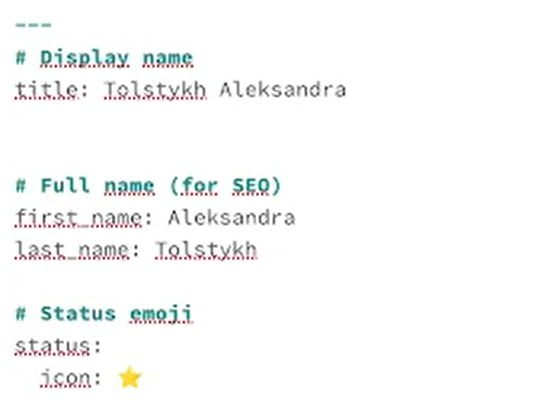{#fig:001 width=70%}

:::
::::::::::::::

## Изменение данных на сайте

:::::::::::::: {.columns align=center}
::: {.column width="30%"}

Изменяю информацию о месте работы.

:::
::: {.column width="70%"}

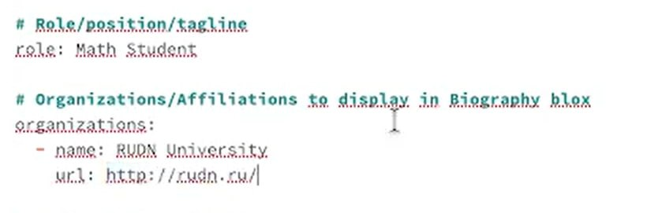{#fig:002 width=70%}

:::
::::::::::::::

## Изменение данных на сайте

:::::::::::::: {.columns align=center}
::: {.column width="30%"}

Добавляю ссылки на социальные сети.

:::
::: {.column width="70%"}

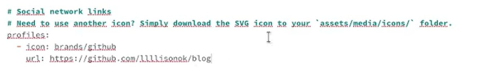{#fig:003 width=70%}

:::
::::::::::::::

## Изменение данных на сайте

:::::::::::::: {.columns align=center}
::: {.column width="30%"}

Заполняю биографию.

:::
::: {.column width="70%"}

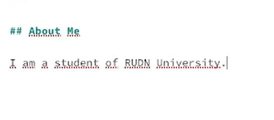{#fig:004 width=70%}

:::
::::::::::::::

## Изменение данных на сайте

:::::::::::::: {.columns align=center}
::: {.column width="30%"}

Меняю аватар.

:::
::: {.column width="70%"}

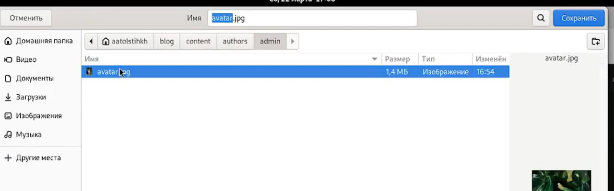{#fig:005 width=70%}

:::
::::::::::::::

## Изменение данных на сайте

:::::::::::::: {.columns align=center}
::: {.column width="30%"}

Меняю адрес сайта.

:::
::: {.column width="70%"}

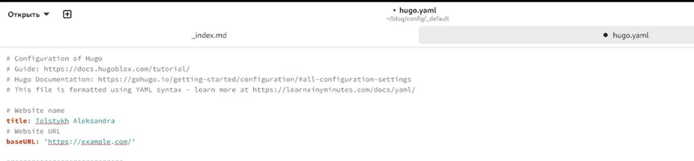{#fig:006 width=70%}

:::
::::::::::::::

## Работа с постами

:::::::::::::: {.columns align=center}
::: {.column width="30%"}

Создаю папку для нового поста.

:::
::: {.column width="70%"}

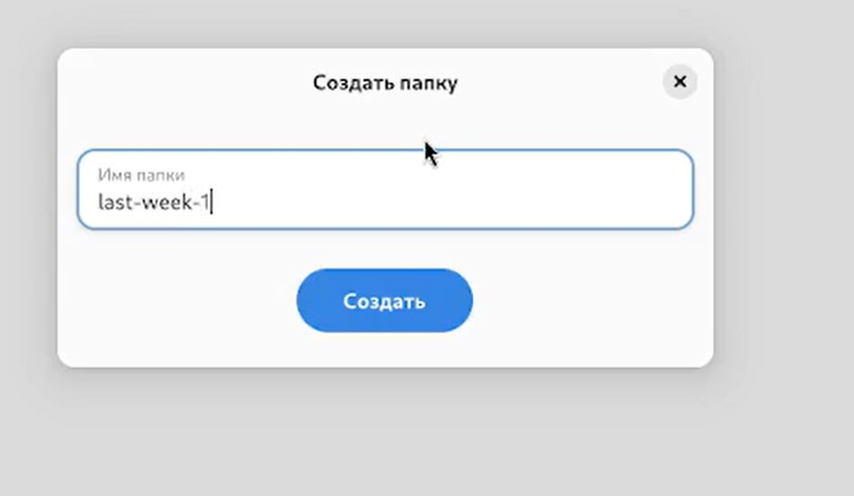{#fig:007 width=70%}

:::
::::::::::::::

## Работа с постами

:::::::::::::: {.columns align=center}
::: {.column width="30%"}

Пишу пост о прошедешей неделе.

:::
::: {.column width="70%"}

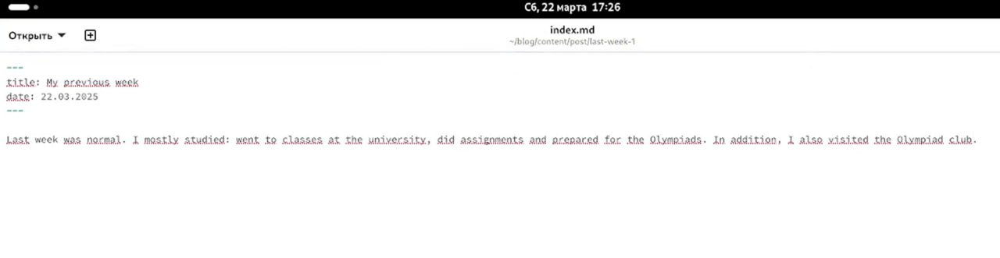{#fig:008 width=70%}

:::
::::::::::::::

## Работа с постами

:::::::::::::: {.columns align=center}
::: {.column width="30%"}

Создаю папку для еще одного поста.

:::
::: {.column width="70%"}

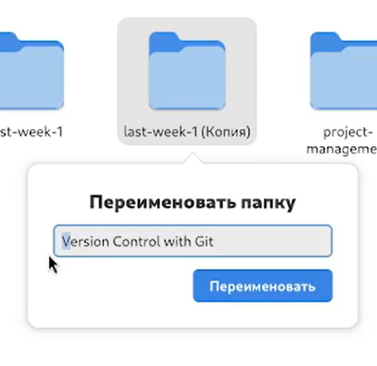{#fig:009 width=70%}

:::
::::::::::::::

## Работа с постами

:::::::::::::: {.columns align=center}
::: {.column width="30%"}

Пишу второй пост.

:::
::: {.column width="70%"}

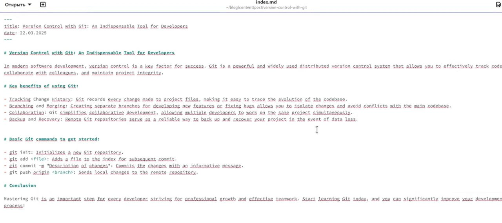{#fig:010 width=70%}

:::
::::::::::::::

## Сохранение изменений

:::::::::::::: {.columns align=center}
::: {.column width="30%"}

Сохраняю изменения на гитхабе.

:::
::: {.column width="70%"}

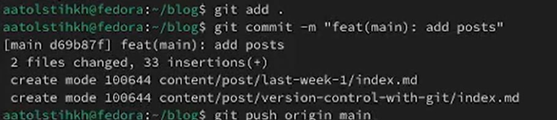

:::
::::::::::::::

# Завершение работы

## Выводы

В результате выполнения лабораторной работы я добавила на сайт информацию о себе и два поста - о прошедшей неделе и о git-е.
